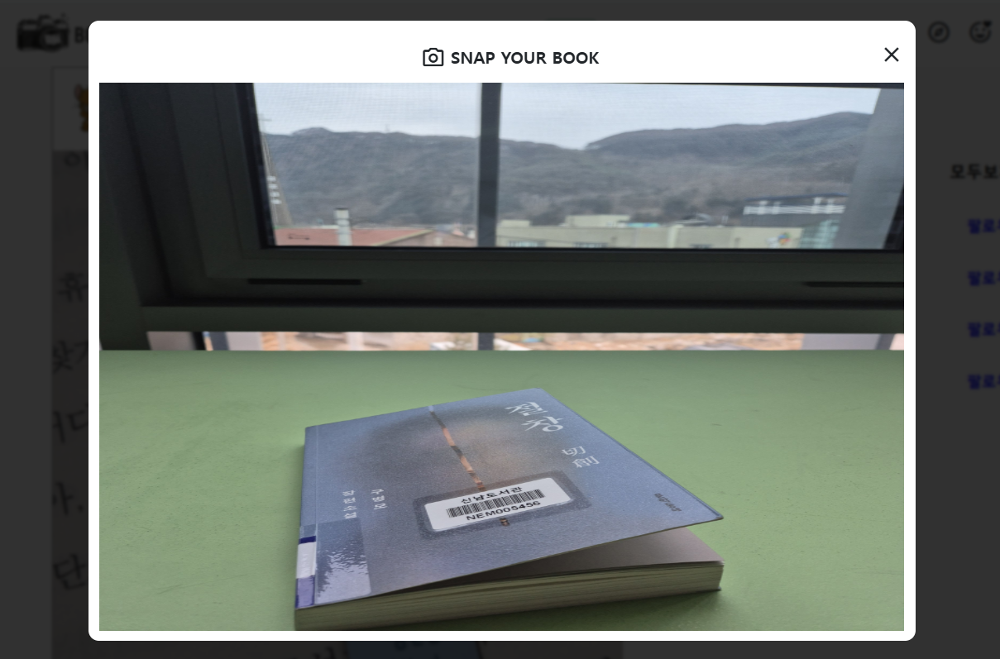

# 📒 BOOKSNAP Development Log

## 2026-02-23

### 🪟 Drop 이후 모달 전환 로직 구현(second_modal)
- first_modal, second_modal로 id를 분리하여 모달 상태를 구분
- 이미지 파일이 정상적으로 감지되면 #first_modal은 display: none, #second_modal은 display: flex로 변경
- 기존 e.target 대신 .img_upload_space 선택자로 변경하여 모달 전환 후에도 정상적으로 이미지가 표시되도록 수정
- second_modal에서 왼쪽(70%) 이미지 창과 오른쪽(30%) 글쓰는 창 배치
- second_modal에서 flex 레이아웃을 적용해 이미지(70%)와 글쓰기 영역(30%)을 분리

📌 **배운 점**
- 모달에 id를 지정하여 JS에서 특정 요소를 제어 할 수 있음
- e.target을 .img_upload_space를 사용하여, 드롭 위치가 아닌 second_modal 기준으로 이미지가 표시됨을 이해
    
- 
---

## 2026-02-22

### 🪟 Modal 구현 및 동작 연결
- 모달 HTML 구조 및 CSS 스타일링 완료
- `#nav_bar_add_box` 클릭 시 `.modal_overlay`를 `display: flex`로 변경하여 모달 오픈
- `overflow: hidden` 적용하여 배경 스크롤 제거

### 🖱 Drag & Drop 이미지 업로드 구현
- `.img_upload_space`에 `dragover`, `dragleave`, `drop` 이벤트 연결
- `e.preventDefault()`와 `e.stopPropagation()`을 사용해 브라우저 기본 동작 제어
- `dataTransfer.files`를 통해 드롭된 파일 정보 접근
- 이미지 파일인지 검사 후 `background-image`로 미리보기 구현

📌 **배운 점**
- HTML은 화면의 구조를 만들고 JS는 동작을 제어하며, 두 요소가 결합되어 동적인 UI가 완성된다는 것 이해
- 'Drog & Drop'의 내부 흐름(이벤트 발생 → 파일 정보 전달 → 파일 접근 → 화면 반영)을 이해
    

---

## 2026-02-21

### 🔄 클래스형 뷰 적용
- 함수형 뷰에서 클래스형 뷰로 구조 변경
- `Main(View)` 형태로 수정
- `urls.py`에서 `Main.as_view()`로 연결

### 🗂 Feed 데이터 템플릿 연동
- `Feed.objects.all()`로 전체 피드 조회
- context에 `{"feeds": feed_list}` 형태로 전달
- 템플릿에서 `` 반복문 적용
- `{{ feed.content }}`, `{{ feed.user_id }}` 등 DB 데이터 동적 출력 구현

📌 **배운 점**
- 함수형 뷰 → 하나의 **함수** 안에서 요청을 처리 (GET/POST를 **직접 분기**해야 함)
- 클래스형 뷰 → 하나의 **클래스** 안에서 여러 요청(GET, POST 등)을 메서드로 **분리해서 처리**

- HTML 서버 → 서버가 **완성된 HTML 화면을 만들어서** 브라우저에 전달
- API 서버 → 서버는 **데이터(JSON)만 전달**하고, 화면은 프론트엔드가 구성
    
---

## 2026-02-20

### 🏗 MTV 구조 이해  
- Model: 데이터 구조 정의 및 DB와 연결  
- Template: 화면(UI) 구성  
- View: 요청을 처리하고 Model과 Template를 연결  
- Django는 MTV 패턴을 기반으로 동작함을 구조적으로 이해  

### ⚙ ORM 개념 이해  
- Django ORM(Object Relational Mapping) 개념 학습  
- SQL을 직접 작성하지 않고 Python 코드로 DB 조작 가능  
- `Feed.objects.create()` 형태로 데이터 생성  
- Python 코드가 내부적으로 SQL로 변환되어 실행되는 구조 이해 

### 🗂 Feed 모델 생성  
- `Feed` 모델 정의 
- (content, image, profile_image, user_id, like_count)  
- `makemigrations` / `migrate` 실행  
- `content_feed` 테이블 생성 확인  
- PyCharm Database 콘솔에서 SQL 직접 실행

📌 **배운 점**
- ORM을 사용하면 Model과 DB가 자동으로 매핑되어 SQL을 직접 작성하지 않아도 DB를 관리할 수 있음   
- 레이아웃(프론트엔드)을 먼저 구현한 뒤, 데이터의 동작 원리의 큰 흐름을 이해
    
---

## 2026-02-19

### 🔧 Navbar 개선
- flex 기반 space-between 정렬 적용
- flex-wrap: nowrap 설정
- CSS 참고 (studiomeal)

### 📱 Feed 레이아웃 1차 구현
- 화면 분할 구조 구현 (좌측 스크롤 / 우측 고정)

#### ⬅ 왼쪽 피드
- 프로필 사진 영역
- 사진 업로드 UI
- 좋아요 / 댓글 / 보관 아이콘
- 댓글 입력창

#### ➡ 오른쪽 영역
- 추천 회원 목록 UI 구성

📌 **배운 점**
- Flexbox 기반 레이아웃 구조를 직접 구성하며 CSS 속성의 동작 원리를 이해함
- 원하는 UI를 구현하기 위해 CSS 속성을 검색하고 적용해보는 과정을 통해 문제를 해결함
- 부모 요소의 너비와 자식 요소의 배치 방식이 전체 레이아웃에 미치는 영향을 체감함
- 특히 `display: flex`, `justify-content`, `flex-direction`, `position: fixed`를 사용해 봄
    
---

## 2026-02-13

### 🎨 프로젝트 로고 제작 및 적용

- 서비스 이름을 **BOOKSNAP**으로 결정
    - BOOK + SNAP의 의미 결합
    - 독서를 사진으로 기록하고 감상평을 남긴다는 컨셉
- 카메라와 책을 활용하여 모던하고 심플한 로고 제작
- navbar 왼쪽에 로고 삽입

### 🛠 Static 이미지 404 문제 해결

- 로고 이미지가 `/static/images/...` 경로에서 로드되지 않음
- Django static 설정 문제로 판단
- `STATICFILES_DIRS` 설정 추가 후 해결

📌 **배운 점**
- Django static 파일 로드 구조 이해
- settings.py 설정의 중요성
- Git을 통한 기능 단위 관리 시작
    
---

## 2026-02-12

### 🧩 네비게이션바 레이아웃 구현

- Bootstrap 기반 navbar 구조 설계
- 좌 / 중앙 / 우 영역으로 레이아웃 분리
- 초기에는 모든 요소가 왼쪽으로 정렬되는 문제 발생
  - `d-flex`, `ms-auto` 클래스가 적용되지 않음
  - Bootstrap CSS가 로드되지 않는 것을 확인
  - CDN 링크의 integrity 값 오류로 인해 브라우저가 파일 로드를 차단함
  - integrity 속성 제거 후 정상 작동 확인

📌 **배운 점**
- CDN integrity 속성의 역할 이해
- Bootstrap이 로드되지 않으면 유틸리티 클래스가 무효화됨
- 개발자 도구(Network 탭)로 CSS 로드 여부 확인 가능
