# 📒 BOOKSNAP Development Log

## 2026-03-11
<div style="display: flex; justify-content: left; gap: 20px;">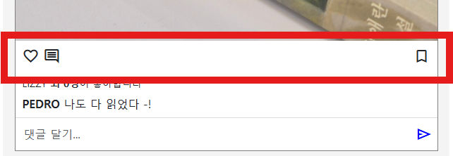
  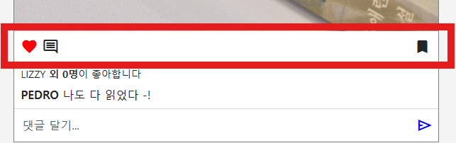</div>
<div style="display: flex; justify-content: left; gap: 20px;">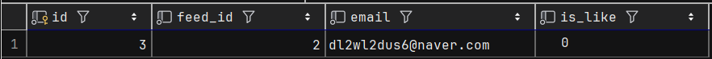
  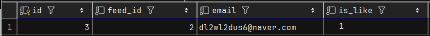</div>
<div style="display: flex; justify-content: left; gap: 20px;">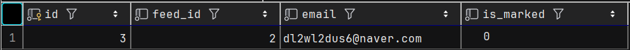
  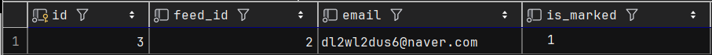</div>

### ❤️ 좋아요 / 🔖 북마크 토글 기능 구현
- 피드 하단에 좋아요(하트)와 북마크 아이콘을 추가하고 클릭 시 상태가 변경되도록 구현
### 1. main.html (프론트 UI - 하트 아이콘)
```
<span id="favorite_{{ feed.id }}"
      feed_id="{{ feed.id }}"
      class="favorite material-symbols-outlined filled">
favorite
</span>
```
### 2. main.html JS (좋아요 클릭 이벤트)   
2-1. 클릭한 게시물 번호 확인
```
let favorite_id = event.target.id;
let feed_id = event.target.attributes.getNamedItem('feed_id')
```
2-2. UI 변경 (♡ ↔ ♥)
```
addClass('filled')
removeClass('filled')
```
2-3. AJAX 요청 (서버로 데이터 전송)
```
$.ajax({ data: { feed_id: feed_id },
         method: "POST",
         url: "/content/like" });
```
### 3. urls.py (요청 연결)
- `/contect/like` 요청이 오면 `ToggleLike` view실행
```
path('like', ToggleLike.as_view())
```
### 4. views.py (ToggleLike View)
- AJAX 요청을 처리하는 View
  - 해당 사용자의 좋아요 기록 조회
```
class ToggleLike(APIView):
    def post(self, request):
        feed_id = request.data.get('feed_id')
        email = request.session.get('email')
        like = Like.objects.filter(feed_id=feed_id, email=email).first()
```
  - 없으면 새로 생성, 있으면 `True ↔ False` 토글
```
        if like is None:
            Like.objects.create(feed_id=feed_id, email=email, is_like=True)
        else:
            like.is_like = not like.is_like
            like.save()
```
### 5. models.py (DB 구조)
- `class Like(models.Model):` 실행 → DB(content_like)에 저장
### 6. views.py 실행(Main View)
- 페이지가 다시 렌더링될 때 각 피드의 좋아요 상태를 계산
```
is_liked = Like.objects.filter(feed_id=feed.id, email=email, is_like=True).exists()
```
### 7. main.html (템플릿 반영)
- True → ♥ / False → ♡
```
filled
```

📌 **배운 점**
- 좋아요 기능을 구현하면서 **웹 서비스의 전체 요청 흐름(Front → AJAX 요청 → Server(Django View 처리) → DB → Template)**을 이해함
  - main.html에서 클릭 이벤트 발생
  - JS에서 AJAX 요청을 통해 서버(/content/like)로 데이터 전달
  - views.py에서 요청을 처리하고 models.py의 Like 테이블 데이터를 수정
  - 이후 Main view에서 좋아요 상태를 조회하여 main.html 템플릿에 다시 반영
<br><br><br><br>

---

## 2026-03-06

### 🔄 프로필 이미지 동기화 문제 해결
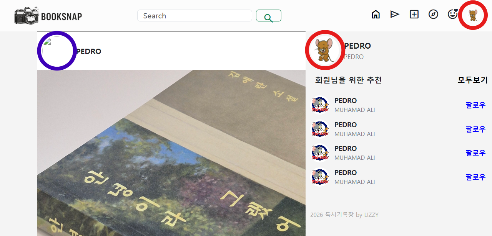<br>
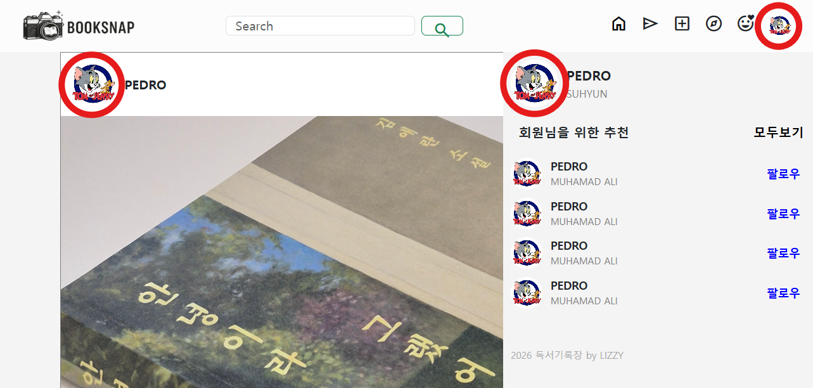<br>
- 기존) 사용자가 피드를 업로드하면 작성자의 정보와 함께 프로필 이미지가 표시 됨
- 문제) 사용자가 프로필을 바꾸면, 전에 업로드했던 피드의 프로필 이미지는 갱신되지 않는 상태로 유지
- 원인) 해당 프로필 부분에, 피드 작성 시점의 사용자 정보(user_id, profile_image)를 직접 사용 (연동되지 않음)
- 해결) 피드에 작성자의 email을 저장, email을 기준으로 user 객체를 조회하도록 구현
  - `class Feed(models.Model):`<br>
        `email = models.EmailField(default='')`
  - `for feed in feed_object_list:`<br>
        `user = User.objects.filter(email=feed.email).first()`
  - 피드 데이터 구성 시 '`user.profile_image`', '`nickname=user.nickname`' 사용 


### 💬 댓글 작성 기능 구현
<div style="display: flex; justify-content: left; gap: 20px;">
  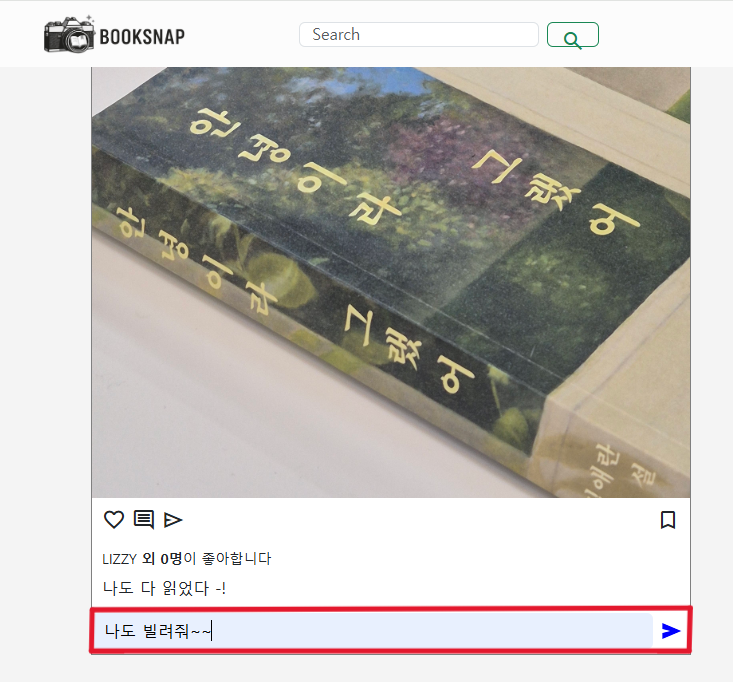
  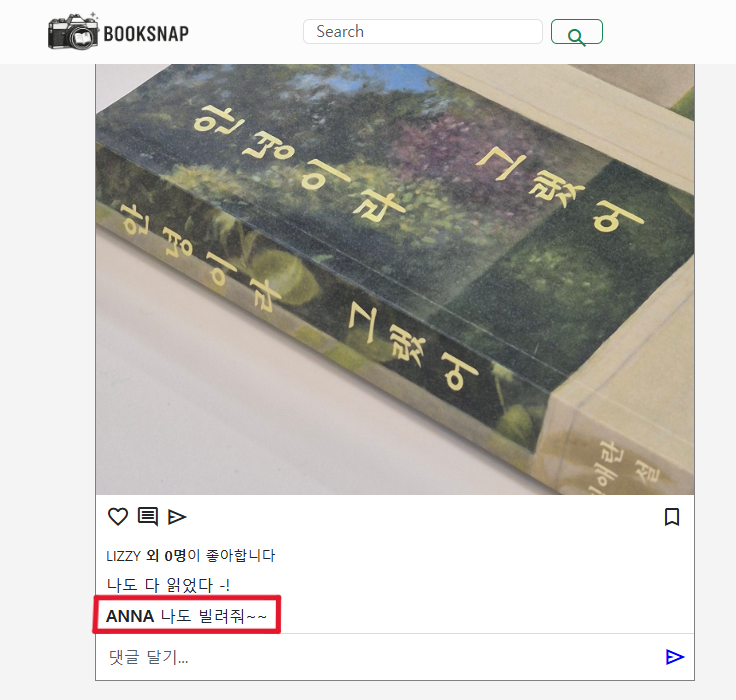
</div>

- 피드 하단에 댓글 입력창을 추가하고 사용자가 댓글을 작성할 수 있도록 구현<br>
  (feed.id를 이용해서 각 피드의 댓글 입력창을 구분 함)<br>
  ```<input id="reply_{{ feed.id }}" type="text" placeholder="댓글 달기..."><br>
  <div class="upload_reply" feed_id="{{ feed.id }}">
- 댓글 입력 후 send 버튼 클릭 시 AJAX 요청을 통해 서버에 전달
  ```let feed_id = event.currentTarget.attributes.getNamedItem('feed_id').value;
  let reply_content = $('#reply_' + feed_id).val();

  $.ajax({
    data: { feed_id: feed_id, reply_content: reply_content },
    url: "/content/reply",
    method: "POST"});
- 댓글 데이터를 Reply 테이블에 저장
  ``` Reply.objects.create(
      feed_id=request.data.get('feed_id'),
      email=request.session.get('email'),
      reply_content=request.data.get('reply_content'))
- 댓글 저장 후 페이지를 새로고침하지 않고 해당 피드의 댓글 목록에 즉시 반영되도록 처리
  ```success: function () {
    $('#reply_list_' + feed_id).append(
        "<div><b>{{ user.nickname }}</b> " + reply_content + "</div>");}

📌 **배운 점**
- 사용자 식별은 고유값으로 관리하는 것이 중요함
  - email을 기준으로 user 정보를 조회하도록 구조를 통일하여, profile_image나 user_id 등 사용자 정보 변경 시 자동 일괄 적용할 수 있었음
  - 또한 Feed에서도 profile_image 등을 직접 저장하지 않고 email을 통해 user 정보를 조회하도록 하여, 사용자 정보 변경 시 자동으로 반영함
- 댓글 기능 구현 과정에서 AJAX를 활용한 비동기 처리 방식을 이해
  - 서버에서는 댓글 데이터를 DB에 저장, 클라이언트에서는 .append()를 사용해 DOM에 댓글을 추가하여 새로고침 없이 댓글이 즉시 반영되도록 구현
- 좋아요 기능은 like_count를 write → update하는 방식과 좋아요 기록을 write → delete하는 방식으로 구현할 수 있음
  - write → update 방식은 구조가 단순하고 성능이 빠르지만, 좋아요 누른 사람의 목록을 조회할 수 없음(단순히 T ↔ F)
  - write → delete 방식은 좋아요를 누르면 like_count +1, 좋아요를 취소하면 like_count -1
  - 추후엔 후자 방법을 써보겠지만, 현재는 전자의 간단한 방식을 사용했음
<br><br><br><br>
  
---

## 2026-03-05

### 📂 프로필 드롭다운 메뉴 구현
<br>
- main.html 상단 프로필 아이콘 클릭 시 드롭다운 메뉴 표시(Bootstrap dropdown 컴포넌트 활용)
- 'MY SNAP → /content/mysnap', 'LOGOUT → /user/logout' 로 이동 (BOOKSHELF 추후 예정)
- **드롭다운 메뉴 레이어 문제 해결**
  - 프로필 드롭다운 메뉴가 오른쪽 피드 영역에 가려지는 문제 발생
  - 피드 영역이 navbar보다 더 높은 stacking context를 가지고 있었기 때문.(피드의 레이어가 더 위)
  - .navbar{ position: relative; z-index: 1050 } 로 문제 해결

### 🖼 MY SNAP 페이지 레이아웃 구현
- /content/mysnap 경로로 이동 시 사용자 프로필 페이지 표시
- flex 레이아웃을 활용하여 프로필 영역과 텍스트 영역을 좌우 배치
- 회원가입 시 profile_image 필드를 기본 이미지로 초기화

### 🔄 프로필 이미지 업로드 및 기능 연동
<br>
- "프로필 사진 편집" 버튼 클릭(`<button id="button_profileupload">`)
- 숨겨진 file input 실행(display: none, `$('#button_profileupload').click(function(){ $('#input_fileupload').click(); })`)
- 파일 선택 시 onchange 이벤트로 profile_upload() 함수 실행(`input type="file"`, `onchange="profile_upload()`")
- Feed 이미지 업로드와 같은 방법(FormData를 AJAX로 전송)으로 진행 (`$.ajax({ url: "/user/profile/upload", method: "POST" })`)
- Django 서버에서 이미지 파일 저장 후 사용자 프로필 이미지 갱신
(`user/views.py → UploadProfile.post()에서 request.FILES['file']로 파일 수신 후 user.profile_image = uuid_name 저장`)
- 프로필 이미지 교체 시 메인 우측 피드, 네비바, MYSNAP 페이지 등 user.profile_image를 사용하는 모든 영역에 즉시 반영하도록 구현 ⬇️<br><br>

- 
<br>

### 👥 사용자별 게시물 프로필 유지
- 다른 사용자 계정으로 로그인할 경우, 해당 사용자가 작성한 feed에는 작성자의 프로필 이미지가 유지된 상태로 표시
- feed 데이터와 user 데이터를 함께 전달하여 템플릿에서 출력({{ feed.user.profile_image }})

📌 **배운 점**
- href의 쓰임
  - href="#" : 현재 페이지의 맨 위로 이동하는 임시 링크. 아직 연결할 페이지가 없을 때 사용
  - href="/content/mysnap" : `<a>` 태그에서 사용하여 클릭 시 해당 URL 경로로 이동할 수 있음
- onchange 이벤트
  - 입력값이 변경되었을 때 실행되는 이벤트
  - 동작 흐름 : 파일 선택 → value 변경 → onchange → profile_upload() 실행 → AJAX로 서버 업로드
- CSS Stacking 문제
  - 여러 요소가 겹칠 때 더 낮은 레이어가 더 높은 레이어 뒤로 숨는 현상
  - 각각의 레이어를 z축 위에 있다고 생각해 'z-index'로 우선순위 조정
<br><br><br><br>

---

## 2026-03-03

<div style="display: flex; justify-content: center; gap: 20px;">
  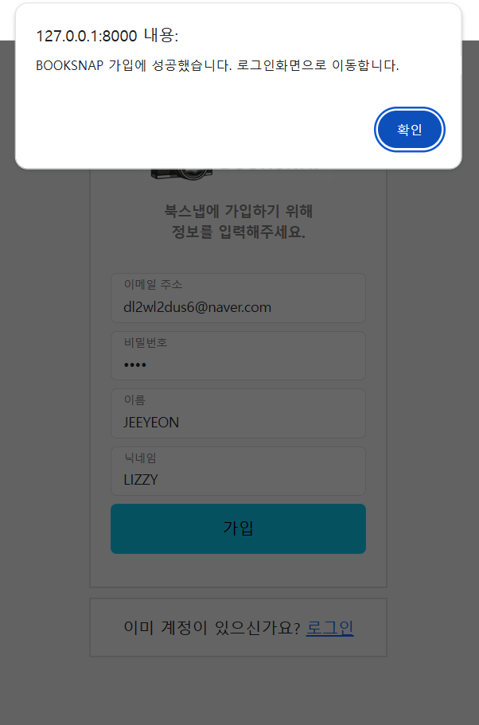
  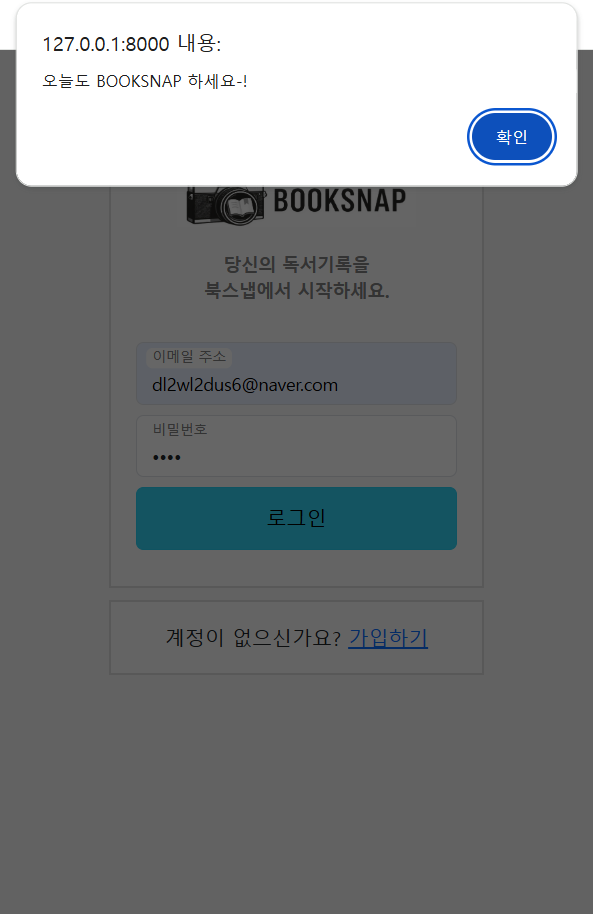
</div>
  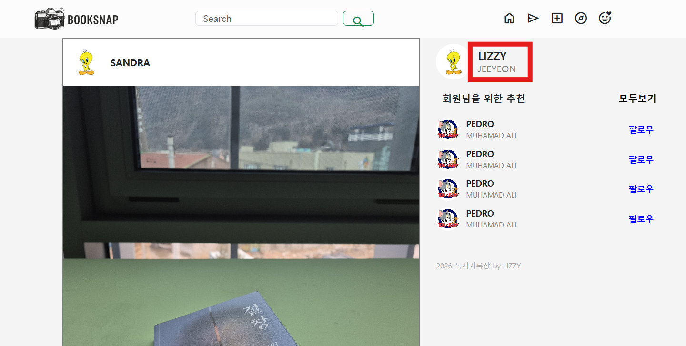

### 🔐 회원가입 기능 구현 (AJAX 기반)
- join.html에서 입력값(email, password, name, nickname) 수집
- $.ajax()를 사용하여 가입 정보를 /user/join으로 POST 요청
- Django Join.post()에서 사용자 생성
- make_password()를 활용해 비밀번호 단방향 암호화 저장
- 가입 성공 시 로그인 화면으로 이동 처리

### 🔑 로그인 기능 구현 (AJAX 기반)
- login.html에서 이메일, 비밀번호 입력값 수집
- $.ajax()를 사용하여 로그인 정보를 /user/login으로 POST 요청
- User.objects.filter(email=email).first()로 사용자 조회
- check_password()로 비밀번호 검증
- 로그인 성공 시 /main으로 이동
- 로그인 실패 시 서버에서 전달한 메시지를 alert로 출력

### 🏠 메인 화면 접근 제어 로직 구현
- request.session.get('email')을 통해 로그인 상태 확인
- 로그인 세션이 없거나 유저가 존재하지 않을 경우 로그인 페이지로 이동
- Feed.objects.all().order_by('-id')로 최신 피드 목록 조회
- render()를 통해 feeds와 user 데이터를 템플릿에 전달

📌 **배운 점**
- 단방향/양방향 암호와의 차이 이해.
  비밀번호는 복호화가 불가능한 단방향 해시 방식으로 저장해야 하며,
  주소나 주민번호 등은 필요 시 복호화가 가능한 양방향 암호화 방식을 사용함
- User.objects.filter(email=email).first()
  filter()은 기본적으로 리스트 형태의 QuerySet을 반환하지만, 
  '.first()'를 활용하면 반복문이나 인덱싱 없이 바로 객체에 접근할 수 있어 코드가 간결해진다.
<br><br><br><br>

---

## 2026-02-26

<div style="display: flex; justify-content: center; gap: 20px;">
  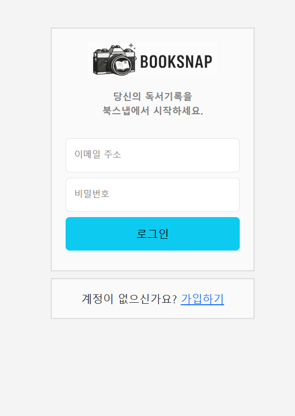
  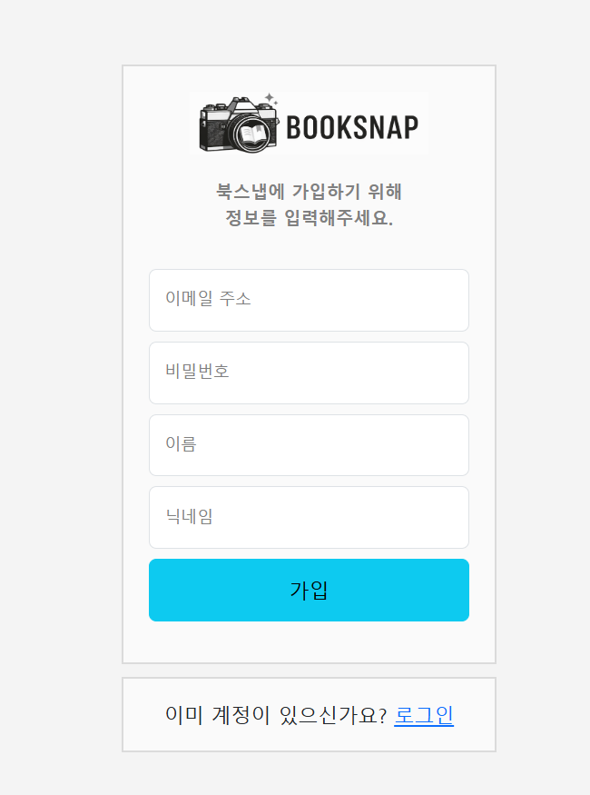
</div>

### 🧾 Join / Login 화면 UI 구현
- Bootstrap form-floating 구조를 활용해 입력 폼 구성
  - 기본 height만 수정 시 스타일이 적용되지 않는 문제 발생
  - form-floating은 height, min-height, padding 등이 동시에 계산되도록 설계되어 있어
    height만 수정 시 min-height 규칙에 의해 무시되기 때문
  - Bootstrap의 min-height, padding, label transform 구조까지 함께 수정하여 정상 동작 구현


📌 **배운 점**
- Bootstrap 컴포넌트는 단순한 스타일 모음이 아니라 여러 CSS 속성이 서로 연결되어 동작하는 구조적 시스템임을 이해
- 특정 속성(height)만 수정하면 다른 속성(min-height, padding, transform 등)에 의해 동작이 유지되거나 깨질 수 있다는 점을 경험
- 원하는 UI를 구현하려면 개별 속성 수정이 아니라 컴포넌트 전체 동작 구조를 파악한 뒤 함께 조정해야 함을 이해
<br><br><br><br>

---

## 2026-02-24

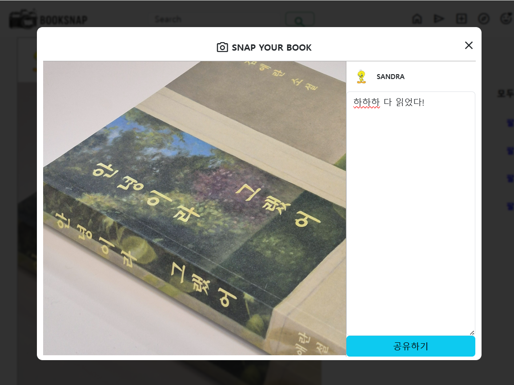
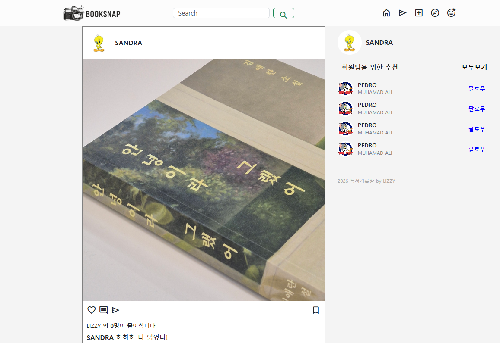

### 📝 Modal2 공유 기능 구현 및 서버 연동
- '#feed_create_button' 클릭 이벤트 구현
- textarea에 입력한 글(content), 업로드한 이미지 파일(file), 작성자 정보(user_id, profile_image)를 jQuery로 수집
- FormData 객체를 생성하여 파일과 텍스트 데이터를 함께 구성
- $.ajax()를 사용해 /content/upload 경로로 POST 요청 전송
- 요청 완료 후 location.replace("/main")로 메인 페이지 재이동 처리

### 🔗 urls.py 경로 연결
- /content/upload 경로를 UploadFeed 뷰와 연결하여 AJAX 요청이 처리되도록 설정
- 🛠 views.py 파일 저장 및 DB 생성
- request.FILES['file']로 이미지 파일 수신
- request.data.get()으로 글 내용 및 사용자 정보 수신
- MEDIA_ROOT 경로에 파일 저장 (uuid 기반 파일명 사용)
- Feed.objects.create()로 새로운 피드 데이터 DB 저장
- Response(status=200) 반환하여 요청 성공 처리

### 🗂 settings.py 및 미디어 경로 설정
- settings.py에 MEDIA_ROOT, MEDIA_URL 설정 추가
- MEDIA_ROOT를 기준으로 업로드 이미지가 media 폴더에 저장되도록 저장 경로 구성
- MEDIA_URL을 활용하여 `{{ feed.image }}` 형태로 이미지 경로를 구성, media 폴더의 파일이 화면에 출력되도록 처리
- uuid 기반 파일명을 생성하여 업로드 파일명 중복 방지

📌 **배운 점**
- (공유하기 클릭 → 데이터 모아서 → 서버에 보내고 → 서버가 저장 → 다시 화면에 보여줌)
- 공유하기 클릭 → <브라우저 JS>  FormData 생성 → AJAX 이용, POST 방식으로 '/content/upload'에 전송 
              → <Django 서버> (urls.py) url(/content/upload)과 UploadFeed와 연결 
                           → (views.py) 'def post(self, request)' 실행(request에서 데이터 꺼내기) 
                           → 'media'에 파일 저장 + 'Feed.objects.create()'로 DB 저장 → 응답 반환 
              → <브라우저>    '/main'으로 이동

- AJAX를 통해 페이지 새로고침 없이 서버와 비동기 통신이 가능함을 이해
<br><br><br><br>

---

## 2026-02-23

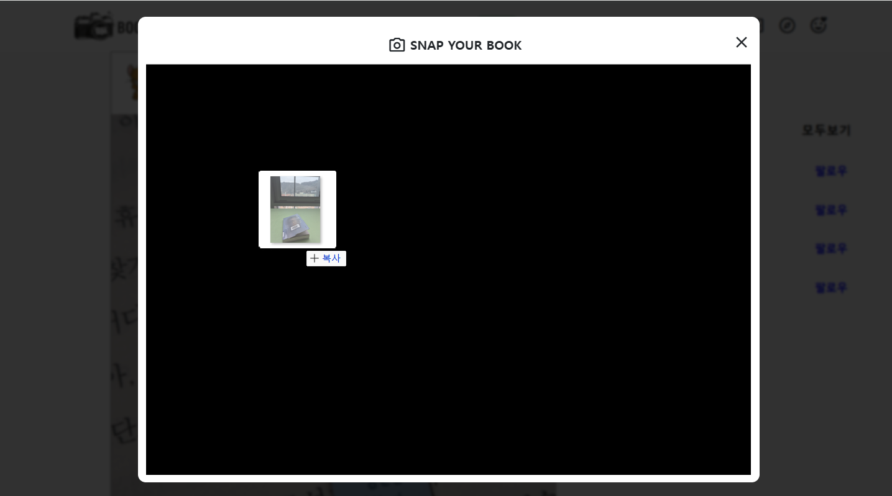
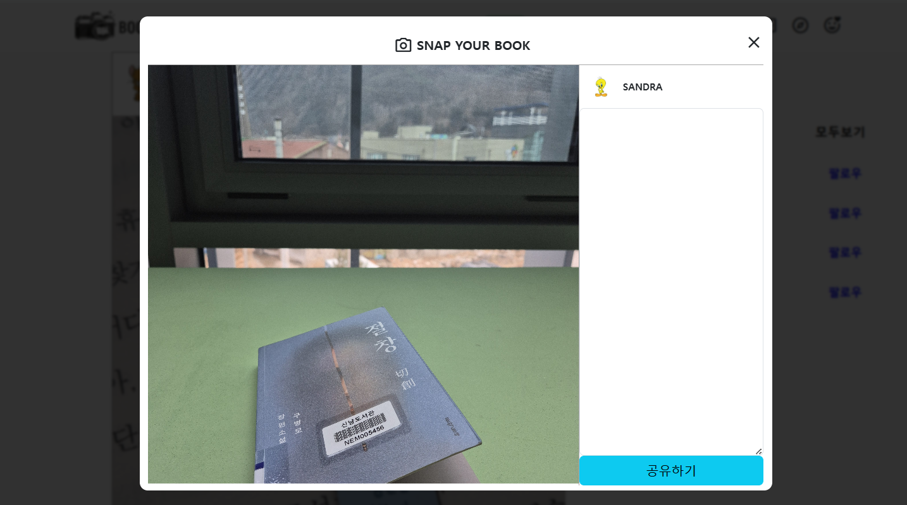

### 🪟 Drop 이후 모달 전환 로직 구현(second_modal)
- first_modal, second_modal로 id를 분리하여 모달 상태를 구분
- 이미지 파일이 정상적으로 감지되면 #first_modal은 display: none, #second_modal은 display: flex로 변경
- 기존 e.target 대신 .img_upload_space 선택자로 변경하여 모달 전환 후에도 정상적으로 이미지가 표시되도록 수정
- second_modal에서 왼쪽(70%) 이미지 창과 오른쪽(30%) 글쓰는 창 배치
- second_modal에서 flex 레이아웃을 적용해 이미지(70%)와 글쓰기 영역(30%)을 분리

📌 **배운 점**
- 모달에 id를 지정하여 JS에서 특정 요소를 제어 할 수 있음
- e.target을 .img_upload_space를 사용하여, 드롭 위치가 아닌 second_modal 기준으로 이미지가 표시됨을 이해
<br><br><br><br>

---

## 2026-02-22

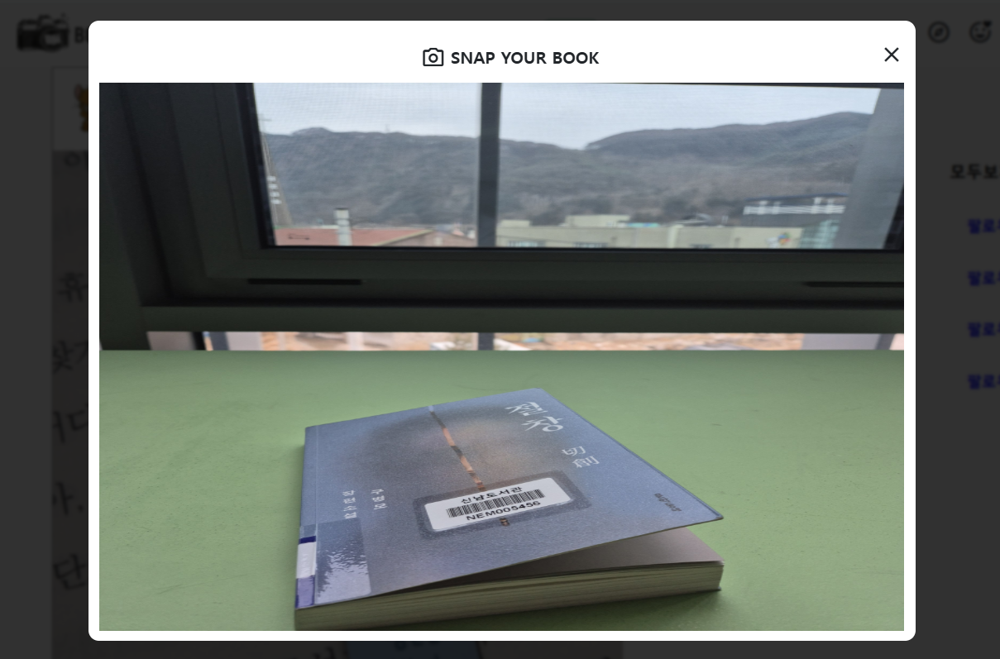

### 🪟 Modal 구현 및 동작 연결
- 모달 HTML 구조 및 CSS 스타일링 완료
- `#nav_bar_add_box` 클릭 시 `.modal_overlay`를 `display: flex`로 변경하여 모달 오픈
- `overflow: hidden` 적용하여 배경 스크롤 제거

### 🖱 Drag & Drop 이미지 업로드 구현
- `.img_upload_space`에 `dragover`, `dragleave`, `drop` 이벤트 연결
- `e.preventDefault()`와 `e.stopPropagation()`을 사용해 브라우저 기본 동작 제어
- `dataTransfer.files`를 통해 드롭된 파일 정보 접근
- 이미지 파일인지 검사 후 `background-image`로 미리보기 구현

📌 **배운 점**
- HTML은 화면의 구조를 만들고 JS는 동작을 제어하며, 두 요소가 결합되어 동적인 UI가 완성된다는 것 이해
- 'Drog & Drop'의 내부 흐름(이벤트 발생 → 파일 정보 전달 → 파일 접근 → 화면 반영)을 이해
<br><br><br><br>

---

## 2026-02-21

### 🔄 클래스형 뷰 적용
- 함수형 뷰에서 클래스형 뷰로 구조 변경
- `Main(View)` 형태로 수정
- `urls.py`에서 `Main.as_view()`로 연결

### 🗂 Feed 데이터 템플릿 연동
- `Feed.objects.all()`로 전체 피드 조회
- context에 `{"feeds": feed_list}` 형태로 전달
- 템플릿에서 `` 반복문 적용
- `{{ feed.content }}`, `{{ feed.user_id }}` 등 DB 데이터 동적 출력 구현

📌 **배운 점**
- 함수형 뷰 → 하나의 **함수** 안에서 요청을 처리 (GET/POST를 **직접 분기**해야 함)
- 클래스형 뷰 → 하나의 **클래스** 안에서 여러 요청(GET, POST 등)을 메서드로 **분리해서 처리**

- HTML 서버 → 서버가 **완성된 HTML 화면을 만들어서** 브라우저에 전달
- API 서버 → 서버는 **데이터(JSON)만 전달**하고, 화면은 프론트엔드가 구성
<br><br><br><br>
---

## 2026-02-20

### 🏗 MTV 구조 이해  
- Model: 데이터 구조 정의 및 DB와 연결  
- Template: 화면(UI) 구성  
- View: 요청을 처리하고 Model과 Template를 연결  
- Django는 MTV 패턴을 기반으로 동작함을 구조적으로 이해  

### ⚙ ORM 개념 이해  
- Django ORM(Object Relational Mapping) 개념 학습  
- SQL을 직접 작성하지 않고 Python 코드로 DB 조작 가능  
- `Feed.objects.create()` 형태로 데이터 생성  
- Python 코드가 내부적으로 SQL로 변환되어 실행되는 구조 이해 

### 🗂 Feed 모델 생성  
- `Feed` 모델 정의 
- (content, image, profile_image, user_id, like_count)  
- `makemigrations` / `migrate` 실행  
- `content_feed` 테이블 생성 확인  
- PyCharm Database 콘솔에서 SQL 직접 실행

📌 **배운 점**
- ORM을 사용하면 Model과 DB가 자동으로 매핑되어 SQL을 직접 작성하지 않아도 DB를 관리할 수 있음   
- 레이아웃(프론트엔드)을 먼저 구현한 뒤, 데이터의 동작 원리의 큰 흐름을 이해
<br><br><br><br>
---

## 2026-02-19

### 🔧 Navbar 개선
- flex 기반 space-between 정렬 적용
- flex-wrap: nowrap 설정
- CSS 참고 (studiomeal)

### 📱 Feed 레이아웃 1차 구현
- 화면 분할 구조 구현 (좌측 스크롤 / 우측 고정)

#### ⬅ 왼쪽 피드
- 프로필 사진 영역
- 사진 업로드 UI
- 좋아요 / 댓글 / 보관 아이콘
- 댓글 입력창

#### ➡ 오른쪽 영역
- 추천 회원 목록 UI 구성

📌 **배운 점**
- Flexbox 기반 레이아웃 구조를 직접 구성하며 CSS 속성의 동작 원리를 이해함
- 원하는 UI를 구현하기 위해 CSS 속성을 검색하고 적용해보는 과정을 통해 문제를 해결함
- 부모 요소의 너비와 자식 요소의 배치 방식이 전체 레이아웃에 미치는 영향을 체감함
- 특히 `display: flex`, `justify-content`, `flex-direction`, `position: fixed`를 사용해 봄
<br><br><br><br>
---

## 2026-02-13

### 🎨 프로젝트 로고 제작 및 적용

- 서비스 이름을 **BOOKSNAP**으로 결정
    - BOOK + SNAP의 의미 결합
    - 독서를 사진으로 기록하고 감상평을 남긴다는 컨셉
- 카메라와 책을 활용하여 모던하고 심플한 로고 제작
- navbar 왼쪽에 로고 삽입

### 🛠 Static 이미지 404 문제 해결

- 로고 이미지가 `/static/images/...` 경로에서 로드되지 않음
- Django static 설정 문제로 판단
- `STATICFILES_DIRS` 설정 추가 후 해결

📌 **배운 점**
- Django static 파일 로드 구조 이해
- settings.py 설정의 중요성
- Git을 통한 기능 단위 관리 시작
<br><br><br><br>
---

## 2026-02-12

### 🧩 네비게이션바 레이아웃 구현

- Bootstrap 기반 navbar 구조 설계
- 좌 / 중앙 / 우 영역으로 레이아웃 분리
- 초기에는 모든 요소가 왼쪽으로 정렬되는 문제 발생
  - `d-flex`, `ms-auto` 클래스가 적용되지 않음
  - Bootstrap CSS가 로드되지 않는 것을 확인
  - CDN 링크의 integrity 값 오류로 인해 브라우저가 파일 로드를 차단함
  - integrity 속성 제거 후 정상 작동 확인

📌 **배운 점**
- CDN integrity 속성의 역할 이해
- Bootstrap이 로드되지 않으면 유틸리티 클래스가 무효화됨
- 개발자 도구(Network 탭)로 CSS 로드 여부 확인 가능
